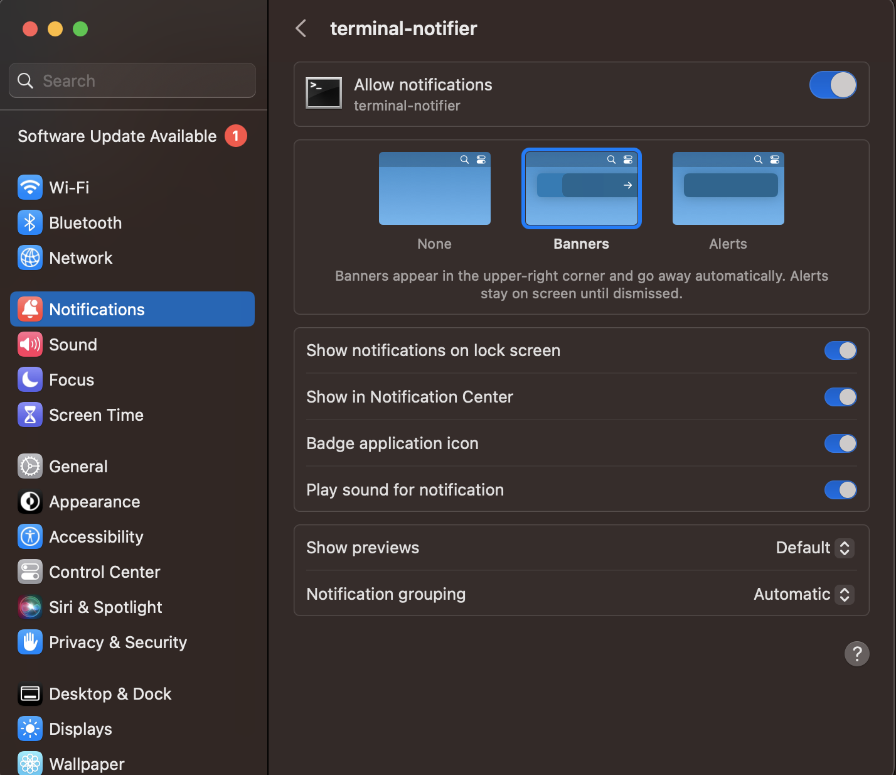

# Description
It sends notifications of inspirational quotes to your Mac to get you motivated and inspired.

You can set up a cronjob to automate the execution of the app. That way, you will get inspirational quotes during your day.

<p align="center">
  
</p>

Also, I have to thank the developer of the API: https://type.fit/api/quotes. It has been key in this project.

**Important!** This only is supported for macOS. Mainly because of the notification library. In the future, it will support Windows too. However, if you want to do it, I will be more than happy to merge your code :)

# MacOS permissions
In MacOS, you need to give permissions to `terminal-notifier` to be able
receive the notifications from the application.
<p align="center">
  
</p>

# Usage
Simply install the library:

```bash
# virtualenv venv
# source venv/bin/activate
pip install src/.
```

Now, run the following command:

```bash
inspi_notifier # it will create a notification with a inspirational quote
```
